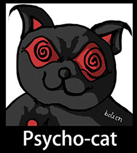
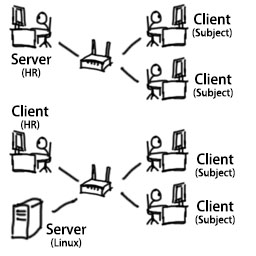

# Psycho-Cat #

为HR设计的简易心里测试软件 ([English Version](README.md))

## 声明

程序还在写! 如果有需求或者吐槽在ISSUE里提.

## 黒历史

我在上个东家的心理测试是用纸和笔的,答了大概4个小时,中间还去吃了个午饭.于是我想,
__你们特喵的心理测试用程序能死????__.于是我自己用PHP写了一个答题网站给HR, 然后HR让我
找大HR,然后大HR说会派人来和我谈,然后……就没有然后了.所以,你在Github上看到了这个东西.

上一个版本是PHP的,但是因为__PHP是世界上最好的语言!__,所以去死吧您嘞!! 新的版本用NodeJS
代替. 因为希望配置能够简单一些,所以数据库用了SQLite, 后面的Release包会包含所有依赖包
和自动安装脚本(Win的上exe, Linux的上sh, Mac的……用Mac的HR还真没见过),
尝试让安装最简化.

## 特点

1. __不需要__连接外网
2. Excel编辑题目,答案,分数,上传入库
3. 测试开始后会生成__测试代号__, 受试者可以关闭浏览器去吃个午饭回来继续答题

## 运行方式

