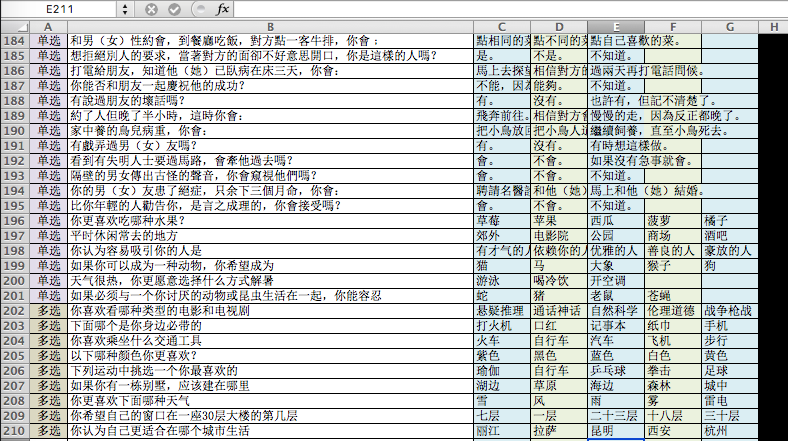
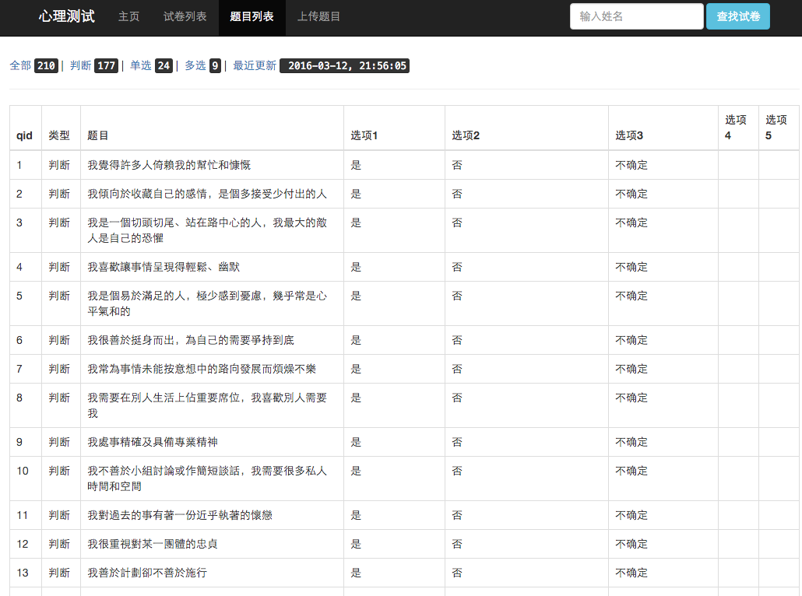
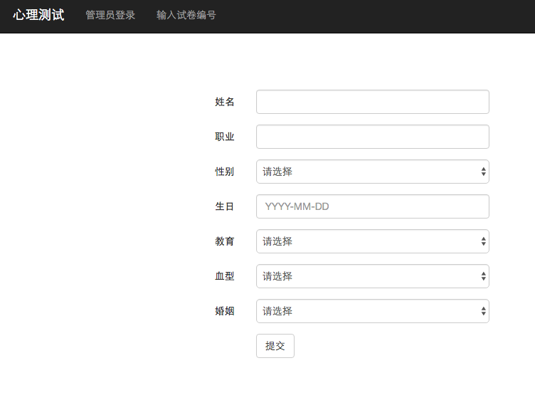
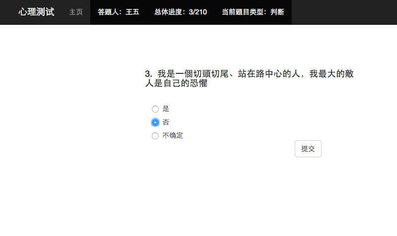
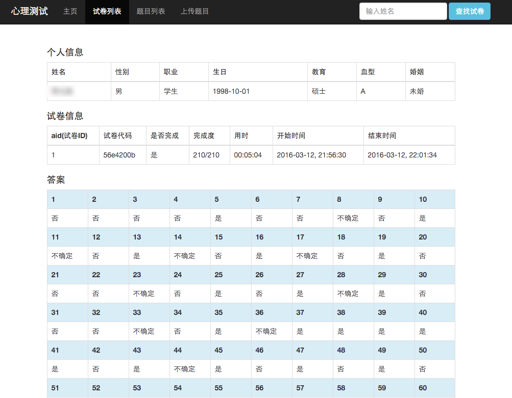

# PsychoCat

用 PHP (CodeIgniter), MySQL & BootStrap 实现的一个心理测试工具
[English Version](README.md)

__这是一个未完成的项目,请等待Release__

## 展示

### 利用EXCEL创建问题和选项,然后另存为CSV

### 通过网页上传CSV,来添加数据到MySQl

### 主页

### 答题中

### 管理员界面

## 需求

* PHP 5+
* MySQL
* Apache

## 优缺点

### 优点
1. 利用 EXCEL + CSV 快速编辑和上传问题
2. 用户可以中断&恢复答题(比如:去吃午饭再回来继续)
3. 用户不能修改已经回答的答案
4. 用户可以通过键盘加快答题速度
5. 多语言支持

### 缺点
1. 需要你的帮助来改进&和除虫
2. 目前不支持含有图像的问题

## 使用

安装XAMPP, 并执行`/doc/sql`下的`sql`文件创建数据库表

## 历史

我在北京亿阳信通面试的时候心理测试是用纸笔的,非常麻烦,于是自己做了这个网站.
因为不知道HR是否会采用,所以放到了GitHub.

## 报错

在Issue标签栏里提交或发送Email到relidin@126.com

## 证书: MIT

---
Beichen Li 2016-7-27